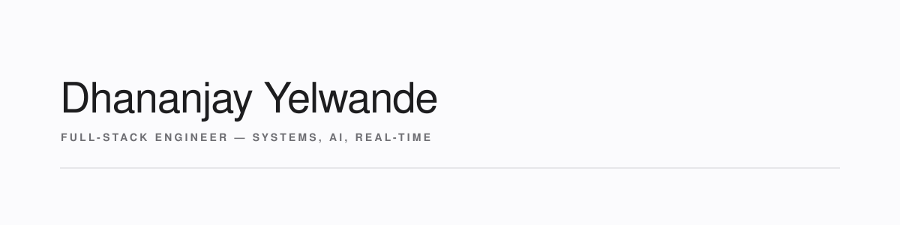

<!-- 

 -->

 

<h1>Hi, I am Dhananjay Yelwande</h1>

<h3>Full Stack Developer</h3>

<b>I have 2+ years designing, building, and shipping enterprise web, real-time IoT, and AI driven systems.</b>

 
<table align="center">
<tr>
<td><b>Languages</b></td>
<td>
 <code>TypeScript</code>
 <code>JavaScript</code>
 <code>Java</code>
 <code>Python</code>
</td>
</tr>

<tr>
<td><b>Frontend</b></td>
<td>
 <code>React</code>
 <code>Next.js</code>
 <code>Tailwind CSS</code>
</td>
</tr>

<tr>
<td><b>Backend</b></td>
<td>
 <code>Node.js</code>
 <code>Express</code>
 <code>Spring Boot</code>
 <code>FastAPI</code>
🌐 <code>WebSockets</code>
📡 <code>MQTT</code>
</td>
</tr>

<tr>
<td><b>AI / ML</b></td>
<td>
🦜 <code>LangChain</code>
🤖 <code>CrewAI</code>
 <code>PyTorch</code>
🔍 <code>Qdrant</code>
🧠 <code>RAG</code>
</td>
</tr>

<tr>
<td><b>Data</b></td>
<td>
 <code>PostgreSQL</code>
 <code>MongoDB</code>
 <code>Redis</code>
</td>
</tr>

<tr>
<td><b>Infrastructure</b></td>
<td>
 <code>AWS</code>
 <code>Docker</code>
 <code>GitHub Actions</code>
 <code>Cloudflare</code>
</td>
</tr>
</table>

<h2 align="center">Connect with Me</h2>

  <strong>Email:</strong> <a href="mailto:yelwandedhananjay@gmail.com">yelwandedhananjay@gmail.com</a>
  &nbsp;&nbsp;|&nbsp;&nbsp;
  <strong>Phone:</strong> <a href="tel:+919657212458">+91 9657212458</a>
  &nbsp;&nbsp;|&nbsp;&nbsp;
  <strong>LinkedIn:</strong> <a href="https://linkedin.com/in/dhananjay-yelwande">linkedin.com/in/dhananjay-yelwande</a>

